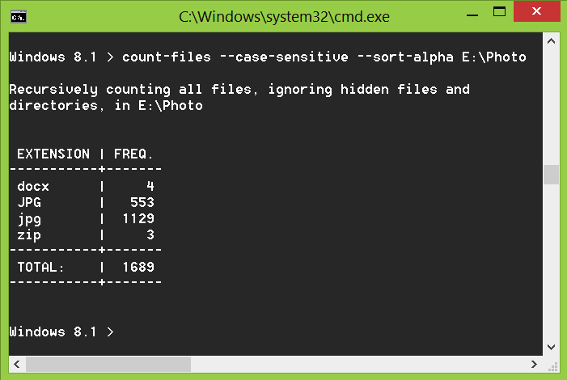
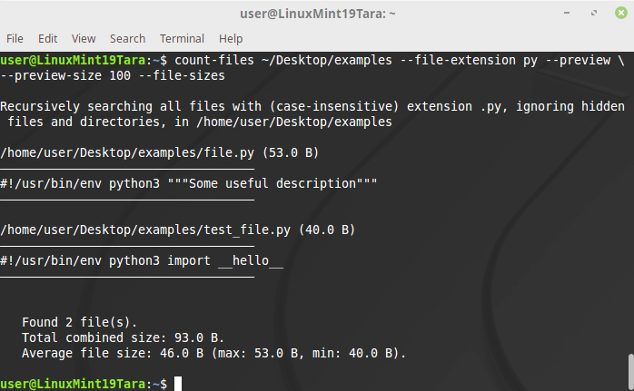

.. _examples-label:

Examples of practical usage
---------------------------
More about the common arguments:

* ``path`` - :ref:`path-label`
* ``--all`` - :ref:`hidden-label`
* ``--case-sensitive`` - :ref:`case-sensitivity-label`
* ``--no-recursion`` - :ref:`non-recursive-label`
* ``--no-feedback`` - :ref:`feedback-label`

.. _count-label:

File counting by extension: sorted table
^^^^^^^^^^^^^^^^^^^^^^^^^^^^^^^^^^^^^^^^

Arguments in short form:
::

   usage: count-files [-a] [-alpha] [-c]
                      [-nr] [-nf] [path]

Arguments in long form:
::

   usage: count-files [--all] [--sort-alpha] [--case-sensitive]
                      [--no-recursion] [--no-feedback] [path]

|

The most simple form of usage is to type a command in the shell, without
any arguments.

By default, it will count files recursively in current working directory and
all of its subdirectories, and will display a table showing the frequency for
each file extension (e.g.: .txt, .py, .html, .css) and the total number of
files found.

In this case, the file extensions in the table will be displayed in uppercase
(default). Any hidden files or folders will be ignored.

Example:

::

   count-files

.. image:: _static/count_linux_mint.png
   :align: center
   :alt: count files linux mint

| 

If you prefer alphabetically sorted results, you just need to add the
``-alpha`` or ``--sort-alpha`` argument.

Example with one of the common arguments::

   count-files -c -alpha [path]

   count-files --case-sensitive --sort-alpha [path]

|

.. _search-label:

File searching by extension: list with file paths
^^^^^^^^^^^^^^^^^^^^^^^^^^^^^^^^^^^^^^^^^^^^^^^^^^^^

Arguments in short form:
::

   usage: count-files [-a] [-c] [-nr]
                      [-fe FILE_EXTENSION] [-fs]
                      [-p] [-ps PREVIEW_SIZE] [path]

Arguments in long form:
::

   usage: count-files [--all] [--case-sensitive] [--no-recursion]
                      [--file-extension FILE_EXTENSION] [--file-sizes]
                      [--preview] [--preview-size PREVIEW_SIZE] [path]

|

This utility can also be used to search for files that have a certain file
extension (using ``-fe`` or ``--file-extension``) and, optionally, display a
short preview (``-p`` or ``--preview``) for text files. The size of the
preview text sample can optionally be customized by using the ``-ps`` or
``--preview-size`` argument followed by an integer number specifying the
number of characters to present.

The list of file types for which preview is available can be viewed with
the ``-st`` or ``--supported-types`` argument.

By default, the result of a search by a certain file extension is a list of
the full paths of the files found. If you need information about the size of
the files, use the ``-fs`` or ``--file-sizes`` argument.

Searching for files with a specific extension
"""""""""""""""""""""""""""""""""""""""""""""

Example:

::

   count-files -fe txt

   count-files --file-extension txt

.. image:: _static/count_linux_mint_fe_txt.png
   :align: center
   :alt: count files linux mint fe txt

|

Example::

   count-files -fe py -p -ps 100 -fs [path]

   count-files --file-extension py --preview
              --preview-size 100 --file-sizes [path]

|

Searching and listing files without extension
"""""""""""""""""""""""""""""""""""""""""""""

Use a single dot ``.`` to search for files without any extension. Files with
names such as ``.gitignore``, ``Procfile``, ``_netrc`` are considered to have
no extension in their name.

Example: ``count-files --file-extension . ~/Documents``

Searching and listing all files
"""""""""""""""""""""""""""""""

Use two dots without spaces ``..`` to search for all files with or without
file extensions in their names.

Example: ``count-files --file-extension .. ~/Documents``

|

.. _total-label:

Total number of files
^^^^^^^^^^^^^^^^^^^^^

Arguments in short form:
::

   usage: count-files [-a] [-c] [-nr] [-nf] [-t EXTENSION] [path]

Arguments in long form:
::

   usage: count-files [--all] [--case-sensitive] [--no-recursion]
                      [--no-feedback] [--total EXTENSION] [path]

|

If you only need the total number of all files, or the number of files with a
certain extension or without it, use the ``-t`` or ``--total`` argument.

To count the total number of files, you must specify the name of the extension.

Total number of files: counting files with a specific extension
"""""""""""""""""""""""""""""""""""""""""""""""""""""""""""""""

Example:

::

   count-files -t txt [path]

   count-files --total txt [path]

.. image:: _static/total_windows.png
   :align: center
   :alt: count total windows txt

|

Total number of files: counting files without extension
"""""""""""""""""""""""""""""""""""""""""""""""""""""""

Use a single dot ``.`` to get the total number of files that don't have an
extension.

Example: ``count-files --total . ~/Documents``

Total number of files: counting all files
"""""""""""""""""""""""""""""""""""""""""

Use two dots without spaces ``..`` to get the total number of files, with or
without a file extension.

Example: ``count-files --total .. ~/Documents``
