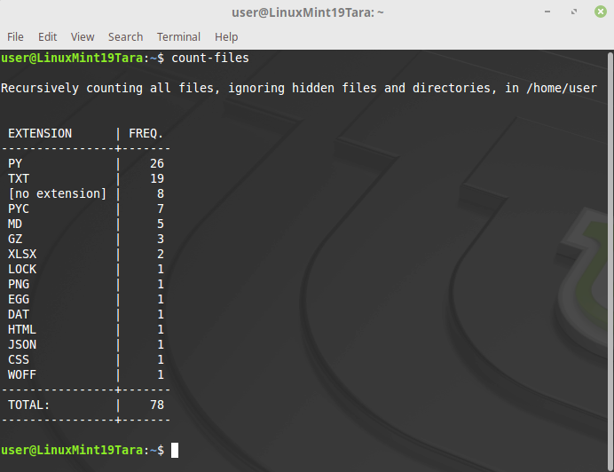
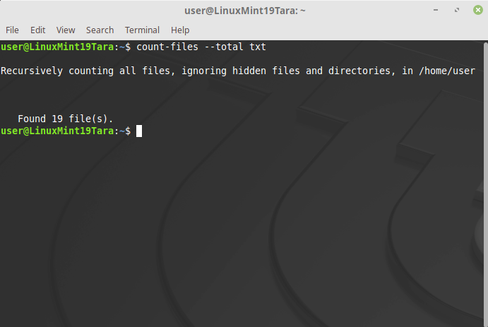

How to use
----------

CLI arguments
^^^^^^^^^^^^^

Arguments can be specified in both short and long form. For example: ``-a`` or ``--all``.
::

   usage: count-files [-h] [-v] [-st] [-a]
                      [-c] [-nr] [-nf]
                      [-t TOTAL] [-alpha]
                      [-fe FILE_EXTENSION] [-fs]
                      [-p] [-ps PREVIEW_SIZE] [path]

   usage: count-files [--help] [--version] [--supported-types] [--all]
                      [--case-sensitive] [--no-recursion] [--no-feedback]
                      [--total TOTAL] [--sort-alpha]
                      [--file-extension FILE_EXTENSION] [--file-sizes]
                      [--preview] [--preview-size PREVIEW_SIZE] [path]

Getting help
^^^^^^^^^^^^

To check the list of available options and their usage, you just need to use
one of the following commands::

   count-files -h

   count-files --help

Check the version number of the program::

   count-files -v
   
   count-files --version

Get the list of currently supported file types for preview::

   count-files -st
   
   count-files --supported-types

.. _path-label:

The `path` argument
^^^^^^^^^^^^^^^^^^^

Optionally, you can pass it a path to the directory to scan. If you prefer, you
can leave that argument empty, and it will scan the current working directory.

To process files in the user's home directory, you can use ``~`` (tilde).

If there are spaces in the folder names, then ``path`` should be specified in quotation marks. For example, in Windows: ``count-files "~\Desktop\New folder"``

.. _non-recursive-label:

Non-recursive search or counting
^^^^^^^^^^^^^^^^^^^^^^^^^^^^^^^^

The optional ``-nr`` or ``--no-recursion`` switch argument tells the
application not to scan recursively through the subdirectories.

.. _hidden-label:

Hidden files and directories
^^^^^^^^^^^^^^^^^^^^^^^^^^^^

By default, it will ignore files and directories that are supposed to be
hidden, but you can add the ``-a`` or ``--all`` optional
switch argument to make it count or search for all files.

Windows: files and directories for which ``FILE_ATTRIBUTE_HIDDEN`` is true

Linux, Mac OS: those with names starting with ``.`` (dot)

.. _case-sensitivity-label:

Case sensitivity
^^^^^^^^^^^^^^^^

The names of extensions are case insensitive by default. The results for
``ini`` and ``INI`` will be the same. To distinguish between similar
extensions in different cases, use the ``-c`` or ``--case-sensitive`` switch
argument.

In this case, the file extensions in the table will be displayed as is (in lowercase and uppercase). And the result of the search will be a list with paths to files with an extension in the corresponding register. For total counting of files with a specific extension, this option is also available.

.. _feedback-label:

Customizing operation feedback
^^^^^^^^^^^^^^^^^^^^^^^^^^^^^^^^^^^^^^^^^^^^^^^^^^^^^

The program's operating indicator is printing processed file names in one line.
File names are not displayed when searching for a particular extension, if
there are no such files in the folder or if the files are hidden, and the
argument ``--all`` is not specified.

Feedback is available by default for counting files by extension (table)
and for counting the total number of files. Optional
argument ``-nf`` or ``--no-feedback`` disables it.

Using the ``--no-feedback`` argument allows you to speed up the
processing of files a little.

To search for files by extension (using ``-fe`` or ``--file-extension``) feedback is the list itself.

Using the CLI
^^^^^^^^^^^^^

Sorted table
""""""""""""

The most simple form of usage is to type a simple command in the shell, without
any arguments.

By default, it will count files recursively in current working directory and
all of its subdirectories, and will display a table showing the frequency for
each file extension (e.g.: .txt, .py, .html, .css) and the total number of
files found. In this case, the file extensions in the table will be displayed in uppercase (default).

Any hidden files or folders will be ignored.

Example:

::

   count-files

List of all found files
"""""""""""""""""""""""

Another main feature of this application consists in searching files by a
given extension, which presents to the user a list of all found files.

Example:

::

   count-files -fe txt

   count-files --file-extension txt

.. image:: _static/count_linux_mint_fe_txt.png
   :scale: 50 %
   :align: center
   :alt: count files linux mint fe txt

Use a single dot ``.`` to search for files without any extension.
::

   count-files --file-extension .

Use two dots without spaces ``..`` to search for all files with or without the extension.

::

   count-files --file-extension ..

Total number of files
""""""""""""""""""""""""""""""

Only the total number of matching files found.

Example:

::

   count-files -t txt

   count-files --total txt

Use a single dot ``.`` to get the total number of files without any extension.
::

   count-files --total .

Use two dots without spaces ``..`` to get the total number of all files with or without the extension.
::

   count-files --total ..

.. seealso:: :ref:`examples-label`

